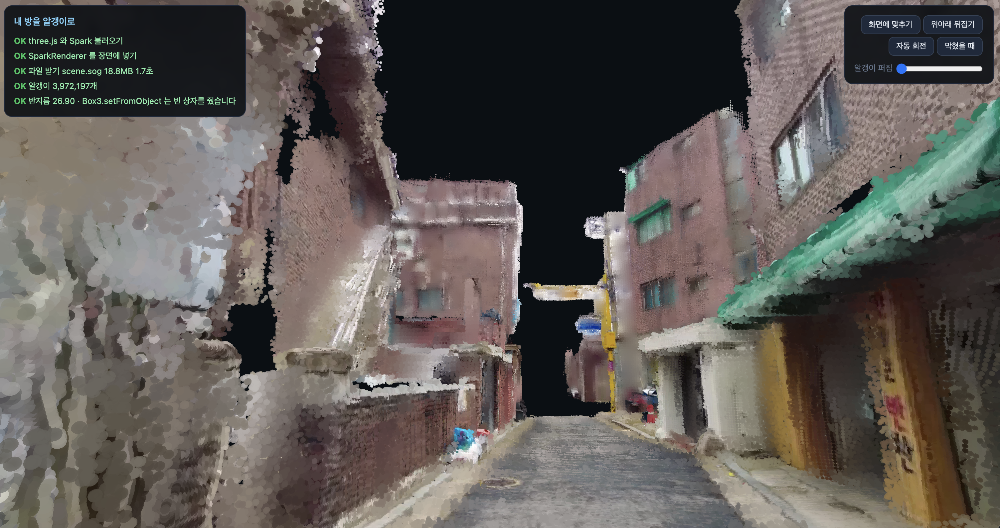
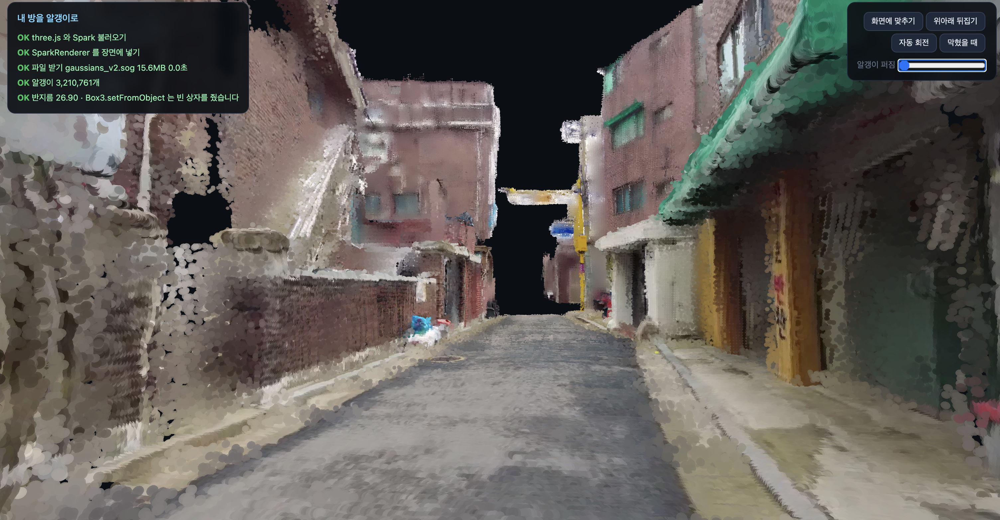

# 고른 공간

## 주소

https://lightnine999.github.io/room-3d-alley/

## 화면

| 최종 (scene.sog, 알갱이 397만 개) | 만드는 중 확인한 화면 (초기 버전, 321만 개) |
|---|---|
|  |  |

## 어디를 골랐나

- 단독빌라와 골목이 있는 주택가. 유튜브에 올라와 있던 영상(제기동 주택가로
  올라온 자료)을 내려받아 20초 안팎으로 편집해 썼다 — 원본이 이미 공개돼
  있던 영상이다.
- 정확한 주소나 건물을 짚어낼 정보(문패·차량 번호판 등)는 화면에 없다.
  간판이 하나 찍히긴 했는데(반찬가게) 흐릿해서 글자가 잘 안 읽힌다.
- 이 정도면 공개해도 무방하다고 판단했다.

## 어떻게 찍었나

- 길이 19초, 1080p, 뽑은 장수 24장
- 카메라가 퍼진 정도 0.50 (0.1이 기준선)
- 나온 점 약 397만 개 (정확히는 3,972,197개)

## 형식별로 잰 값

| 형식 | 파일 크기 | 알갱이 개수 | 알갱이당 바이트 |
|---|---|---|---|
| .ply | 270.1MB | 3,972,197 | 68.00 |
| .compressed.ply | 64.7MB | 3,972,197 | 16.28 |
| .sog | 19.7MB | 3,972,197 | 4.96 |
| .spz | 32.9MB | 3,972,197 | 8.27 |

`.ply`를 알갱이 개수로 나누면 정확히 68이다. 이건 정상이다 — 각도별 색(f_rest_0~44,
45칸)을 학습으로 채우지 않고 헤더에서 아예 뺐기 때문이다. 넣으면 62칸(각도별 색
포함)이라 훨씬 커지고, 우리처럼 뺀 파일은 자리(3)+법선(3)+기본색(3)+불투명도(1)+
크기(3)+회전(4) = 17칸 × 4바이트 = 68바이트/알갱이가 나온다.

## 폰에서 첫 화면까지

- 내 폰 1-2초, 남의 폰도 1-2초로 비슷했다.

## 안 나온 자리

- 검은 얼룩이 남은 곳은 사람이 서서 찍을 때 눈에 안 들어오던 자리다. 여러 사진이
  같은 자리를 겹쳐 봐야 시차(parallax)가 생겨 거리를 셈할 수 있는데, 카메라가
  한 번도 거기를 비추지 않았으니 시차 자체가 없다. 그래서 지어내지 않고
  그대로 비워뒀다.
- 앞뒤·위아래가 뒤집혀 보인다면 좌표축 정렬 순서가 어긋난 것이다. 이 모델은
  Y축이 아래를 향하는 좌표계를 내놓는데, 웹에서 쓰는 three.js 는 Y축이 위를
  향한다. 그래서 y·z 두 축의 부호를 뒤집어 정렬 순서를 맞췄다 — 안 맞추면
  장면이 거꾸로 서거나 안팎이 뒤집힌 것처럼 보인다.
- 전신주의 전선은 점 모양(선형성)으로 판정해 지웠고, 건물 벽의 작은 구멍은
  이웃 격자의 색을 반복 확산시켜 주변 벽 질감·톤에 맞춰 메웠다.
